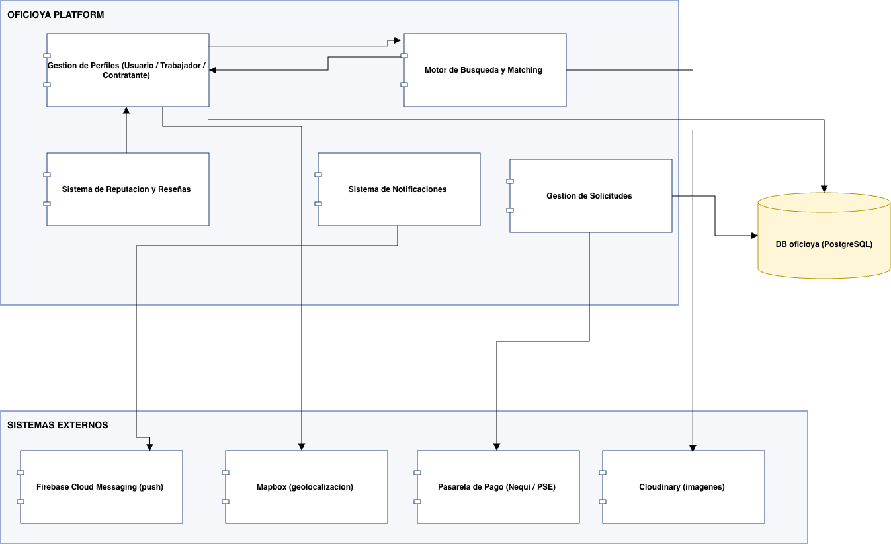
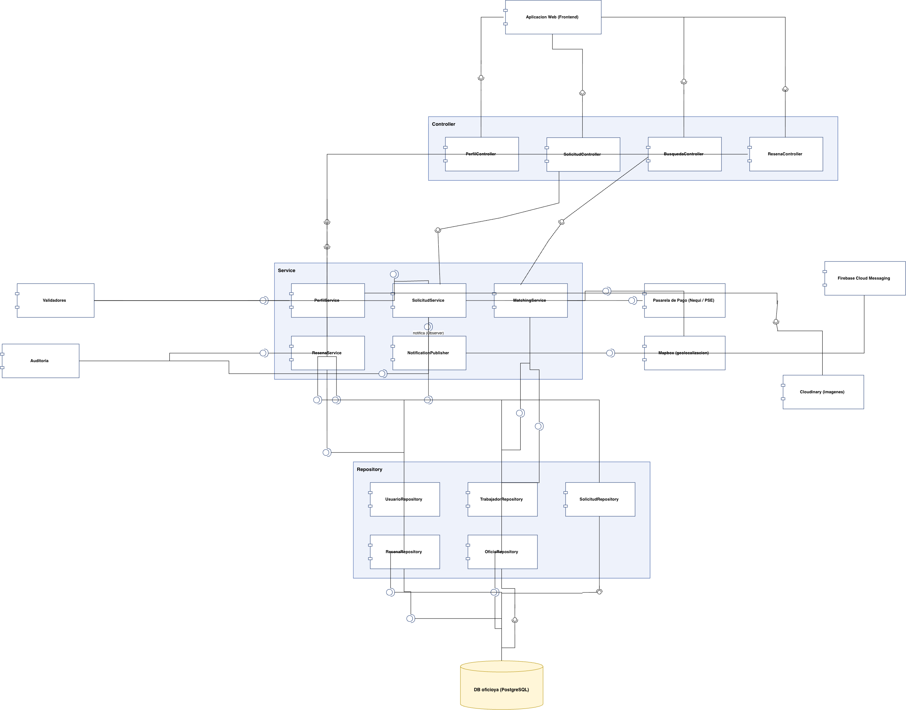
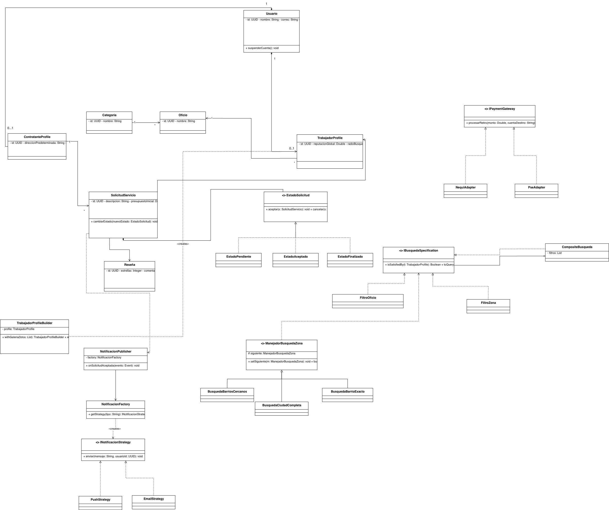

# 🛠️ OficioYa 
Este repositorio contiene la arquitectura, el análisis de diseño y el código base del backend para el proyecto OficioYa.

# Patrones de Diseño
---

## 1. Patrones de Diseño Individuales

### Patrón Creacional: Builder

* **Problema del proyecto:**  
  La plataforma maneja perfiles heterogéneos mediante "Categorías especiales". Un profesor debe registrar materias y nivel, un cuidador de mascotas debe indicar los animales que atiende, y un técnico debe listar marcas especializadas. Utilizar un constructor tradicional generaría una clase llena de atributos nulos para los oficios que no los requieran.

* **Solución propuesta:**  
  Se implementa el patrón Builder para la entidad `PerfilTrabajador`. Esto permite construir el objeto paso a paso según el oficio seleccionado, añadiendo únicamente los atributos que corresponden a su categoría.

* **Sustento técnico:**  
  Cumple con el Principio de Responsabilidad Única (SRP). Facilita el requerimiento de que *"el perfil se crea en menos de 5 minutos desde el celular"*, ya que el backend solo valida y procesa los pasos (datos básicos, zona, especialidades, galería) pertinentes al flujo específico de ese trabajador, aislando la lógica de construcción compleja del resto del sistema.

---

### Patrón de Comportamiento: Observer

* **Problema del proyecto:**  
  Cuando el contratante emite una "Solicitud de servicio", el sistema debe notificar en tiempo real a uno o varios trabajadores cercanos. Además, existe la necesidad de alertar a quienes marcaron su estado como 'disponible ahora' ante urgencias (*"como pedir un taxi"*).

* **Solución propuesta:**  
  El patrón Observer establece un modelo de suscripción reactivo. La `SolicitudServicio` actúa como el sujeto (*Publisher*) que emite un evento al ser creada. Los canales de comunicación (como el servicio de notificaciones Push de Firebase) actúan como observadores (*Subscribers*) que reaccionan al evento.

* **Sustento técnico:**  
  Garantiza un bajo acoplamiento. La clase que gestiona las solicitudes de trabajo no necesita conocer la implementación de los envíos de notificaciones. Cumple con el Principio Open/Closed (OCP), ya que en el futuro se pueden agregar nuevos observadores (ej. notificaciones por SMS o WhatsApp) sin modificar la lógica central del emparejamiento.

---

### Patrón de Comportamiento: Strategy

* **Problema del proyecto:**  
  El sistema de "Búsqueda de servicios" presenta diferentes variaciones algorítmicas: una búsqueda general (filtrada por texto, zona y ordenación por reputación) y una búsqueda de urgencias (filtrada estrictamente por 'disponible ahora'). La regla de negocio exige que los resultados se ordenen por *"distancia y reputación, nunca por pago"*.

* **Solución propuesta:**  
  Se utiliza el patrón Strategy para encapsular las diferentes lógicas de búsqueda y ordenamiento en clases independientes (`BusquedaPorMeritoStrategy`, `BusquedaUrgenciaStrategy`).

* **Sustento técnico:**  
  Evita el uso de múltiples condicionales (`if`/`else`) en los servicios, mejorando la mantenibilidad. Además, aísla la lógica que calcula el posicionamiento, garantizando a nivel de código que es imposible inyectar variables de "pago por publicidad", blindando así la promesa de valor de la plataforma.

---

### Patrón Estructural: Decorator

* **Problema del proyecto:**  
  La plataforma plantea una evolución dinámica del estado del trabajador. Existe una "Verificación progresiva" donde, al alcanzar 10 trabajos, se otorga el badge de 'Identidad Verificada'. Asimismo, el modelo de negocio contempla a futuro una "suscripción 'Pro' opcional" con acceso a estadísticas avanzadas.

* **Solución propuesta:**  
  El patrón Decorator permite envolver el objeto base (`PerfilBasico`) con nuevas responsabilidades o permisos en tiempo de ejecución (`PerfilVerificadoDecorator`, `PerfilProDecorator`).

* **Sustento técnico:**  
  Previene el uso excesivo de subclases (evitando crear clases rígidas como `UsuarioBasico`, `UsuarioVerificado`, `UsuarioPro`, `UsuarioVerificadoPro`). Permite que la plataforma escale hacia su modelo de monetización futuro de forma transparente, agregando funcionalidades a los trabajadores sin alterar el código de los perfiles que se mantienen de forma gratuita.

---

### Patrón Comportamental: Chain of Responsibility

* **Problema del proyecto:**  
  Si un contratante busca un carpintero en su barrio exacto y no hay resultados, el sistema debe expandir la búsqueda gradualmente sin llenar el controlador de `if-else` anidados.

* **Solución propuesta:**  
  Se crea una cadena de manejadores: `HandlerBarrioExacto` → `HandlerRadioAmpliado` → `HandlerCiudad`. Cada eslabón intenta resolver la búsqueda. Si la lista de resultados está vacía, delega la petición al siguiente eslabón geográfico.

* **Sustento técnico:**  
  Reduce drásticamente el acoplamiento. Permite insertar nuevos niveles de búsqueda en el futuro.

---

### Patrón Comportamental: State

* **Problema del proyecto:**  
  El ciclo de vida de un servicio es estricto: `PENDIENTE` → `ACEPTADO` → `EN CURSO` → `FINALIZADO`. Manejar las transiciones válidas con simples sentencias `if (estado == 'PENDIENTE')` es frágil y propenso a errores críticos (Ej. Alguien podría cancelar un servicio ya finalizado).

* **Solución propuesta:**  
  La clase `Solicitud` mantiene una referencia a una interfaz `EstadoSolicitud`. Las clases concretas dictan el comportamiento. Si se intenta cancelar desde un `EstadoFinalizado`, la clase concreta lanza directamente una `IllegalStateException`.

* **Sustento técnico:**  
  Fortalece la integridad del modelo de dominio. Previene alteraciones maliciosas en la capa de servicios.

---

### Patrón Estructural: Adapter

* **Problema del proyecto:**  
  Los requerimientos exigen interactuar con sistemas externos: Mapas y Pasarelas de Pago. Conectar el código fuente directamente a las APIs de estos proveedores causa un altísimo acoplamiento; si Google o Nequi cambian su API, el sistema de OficioYa colapsaría.

* **Solución propuesta:**  
  Se crean interfaces internas. Luego se implementan clases concretas que "traducen" las peticiones internas al formato JSON/XML que espera el proveedor.

* **Sustento técnico:**  
  Es la única forma profesional de proteger el sistema central contra fallos de terceros. Permite simular los pagos y mapas durante el testing unitario inyectando un mock.

---

### Patrón Estructural: Composite

* **Problema del proyecto:**  
  Un usuario busca simultáneamente por Categoría, Precio, Reputación y Zona.

* **Solución propuesta:**  
  Cada filtro es una hoja (`FiltroZona`, `FiltroPrecio`) que implementa la interfaz `ISpecification`. El Composite une todas las hojas en una consulta dinámica mediante conectores `AND` / `OR` antes de ejecutar la consulta en la base de datos (evitando la iteración ineficiente en memoria).

* **Sustento técnico:**  
  Reduce el código repetido y utiliza la tipificación para la categorización de filtros, así cumple el principio de SRP y permite no manchar el código de switches e `instanceof`. Además se puede tratar el filtro como parte de la hoja y generar múltiples filtros al mismo tiempo.

---

## 2. Patrones Combinados

### Builder + Decorator

* **Justificación:**  
  Esta combinación desacopla la instanciación de perfiles heterogéneos de su evolución y asignación de privilegios en tiempo de ejecución.

* **Builder:**  
  Resuelve la "Construcción Heterogénea". Ensambla paso a paso el objeto `PerfilTrabajador` según la categoría del oficio, previniendo constructores telescópicos y evitando clases llenas de atributos nulos.

* **Decorator:**  
  Encapsula la "Evolución en Runtime". Envuelve dinámicamente al objeto base (`PerfilBasico`) con nuevas responsabilidades a medida que el usuario acumula méritos en la plataforma, sin alterar la entidad original.

* **Conclusión:**  
  Erradica la explosión combinatoria de herencia. Cumple estrictamente con el principio de Responsabilidad Única en la fase creacional y con el principio Abierto/Cerrado durante la extensión de funcionalidades en producción.

---

### Observer + Strategy + Factory

* **Justificación:**  
  Esta es la solución combinada más robusta del sistema, encargada de manejar alertas sin acoplar los servicios.

* **Observer:**  
  Desacopla el cuándo. Cuando una solicitud es aceptada, el `RequestService` emite un evento genérico. No sabe a quién ni por dónde se enviará la notificación.

* **Factory:**  
  Al recibir el evento, un Listener utiliza una Factory para determinar qué servicio de mensajería instanciar basándose en las preferencias del usuario.

* **Strategy:**  
  Encapsula el cómo. El Factory retorna una interfaz. El listener simplemente ejecuta el método `enviar()`.

* **Conclusión:**  
  Solución empresarial pura. Cumple al 100% con los principios OCP y SRP. Reemplaza las condicionales lógicas en favor de inyección de dependencias.

---

## 🏗️ Arquitectura y Componentes

El proyecto sigue una arquitectura REST Multicapa (Controller - Service - Repository).

### Diagrama de Componentes General

### Diagrama de Componentes especificos

### Diagrama de Clases

